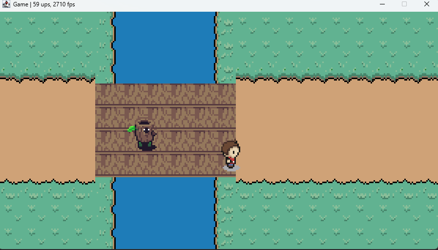

# **HOLLOW LIGHT**

 <!-- Replace with the actual path to a screenshot of your game -->

## **Overview**

- Welcome to **Hollow light**, a 2D tile-based game where idea the mechanics are not yet determined i am just having fun experimenting with game dev no particular idea is set yet
---

## **Features**
- **Tile-based rendering** with multiple layers (ground, objects, etc.).
- **Player movement** and interaction with a tile-based grid.
- Customizable **map design** using the Tiled editor.
- Efficient rendering with optimized performance.
- Extendable for future features like mobs ai and combat systems.

---

## **Technologies Used**
- **Programming Language:** Java
- **Rendering:** Custom rendering logic with tile-based mechanics
- **Map Editor:** [Tiled](https://www.mapeditor.org/)
- **File Format:** JSON for importing and parsing map data
- **Tilesets:** Custom-designed tiles

---

## **How to Customize Maps**

1. Open the **Tiled** map editor.
2. Create or edit your map using the tile set in the ressources folder "src/main/resources/textures/gfx/Overworld.png" (make sure its 64x64 dimension).
3. Export the map as a `.json` file.
4. Replace the `map.json` file in the `resources` folder with your new map.
5. Run the game to see your new world in action.

---

## **Directory Structure**

```
tile-based-adventure/
├── src/                   # Source code
│   ├── Game.java          # Game loop and logic
├── assets/                # Game assets (tilesets, sprites, etc.)
├── bin/                   # Compiled files
```

---

## **Planned Features**
- **Items and Inventory**: Allow players to collect items.
- **Enemy AI**: Introduce NPCs or enemies with simple AI.
- **Combat system**: Introduce a combat system with enemy mobs.

---

## **Contributing**

Contributions are welcome! Here's how you can help:
1. Fork the repository.
2. Create a new branch for your feature/bugfix.
3. Submit a pull request with a detailed description of your changes.

---

## **Acknowledgments**
- Special thanks to youtuber and developper [TheCherno](https://www.youtube.com/@TheCherno) for his courses and videos about game development.
- Special thanks to the developers of [Tiled](https://www.mapeditor.org/) for their awesome map editor.
- Inspired by classic tile-based games like *Zelda* and *Pokémon*.
